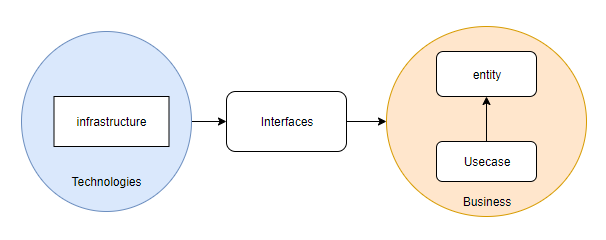

# Manual-Text-Annotation
Inspired by https://github.com/chakki-works/doccano, this app is an attempt to build a useful tool that supports human annotation for sentiment analytics in the MERN (MongoDB-Express-Reactjs-Nodejs) stack way. It is also my internship's project from which I learned a lot not just absorbing languages but also paying attention to the program's structure and keeping my code as clean as possible. Here is all my knowledge I gained from this experience including materials, personal notes, further reading and all sort of problem you might encounter. I decided to share it as a way to revise myself and hopefully, you find it helpful.

## Table of contents
* [The CLEAN Architecture](the-clean-architecture) 
## 1. The CLEAN Architecture 
Here is an overview of the CLEAN architecture from the author website: https://blog.cleancoder.com/uncle-bob/2012/08/13/the-clean-architecture.html 

I strongly recommend you to read more details on Uncle Bob's website in order to get the whole picture. However, I'm going to give you some of my personal experiences by practicing it below: 
* First, you may notice the arrows pointing inwards towards the middle of every circle. It represents something called `Dependency rules`.The rule tells us that changes in the outer layer do not affect the inner layer at any cost or the outer layer depends on the inner layer and not in return. It is worth noting that the further you go to the middle, the less likely changes happen in your application. Personally, the practice of CLEAN architecture is the practice of following `Dependency rules`. 
* Second, about each layer: 
    * ###### Entities (or Domain):
        Business objects. for example, A dating app may have some entities such as user, message, comment,etc.. These are the core of your application (I like to think of these as your organs inside your body). They are also business policies, so they must be determined first and less likely to change, otherwise, it can cause damages to the whole system. 
    * ###### Usecase: 
        Relationships between entities. (Here is where the methods/functionalities come in). Entities work together. For example, "posting a comment" is a use case because user entity and comment entity must work together to establish this connection. I want to emphasize that a use case is purely a relationship between entities so it only depends on entities.
    * ###### Interfaces (or deliveries): 
        A bridge between Business and Technologies. If the two layers above follow the business rules, this layer helps to create a connection between the business world and the technologies world. How can it do that? with `Interfaces`, of course (Check this out if you are not familiar with).For example, you may have an interface to connect between your use cases with the framework you use (Controller) or an interface to present the outcome to the UI (Presenter) or an interface to interact with your database (Gateway). Be careful, you might think because it connects to both business and technology so it depends on those two.Actually, the connection likes this:  business rules <- interfaces <- technologies (not like this: business <- interfaces -> technologies).So business rules are the input of interfaces (interfaces depend on what business gave) and interfaces are the input of technologies (technologies depend on what interfaces gave). 
    * ###### Infrastructure: 
        Technologies details that you use. For instance: what framework, what database, what UI, etc. It is the most outer layer for a reason that it is the most likely to change over time since current technologies can be outdated someday,but guess what, your application will survive because the other layers do not care about what technologies you use, so the only thing you have to do is to take off the old technologies layer and put on the updated one without any changes to inner layers at all. How convenient and efficient it is.
        ##### Here is my schema about Clean architecture: 

